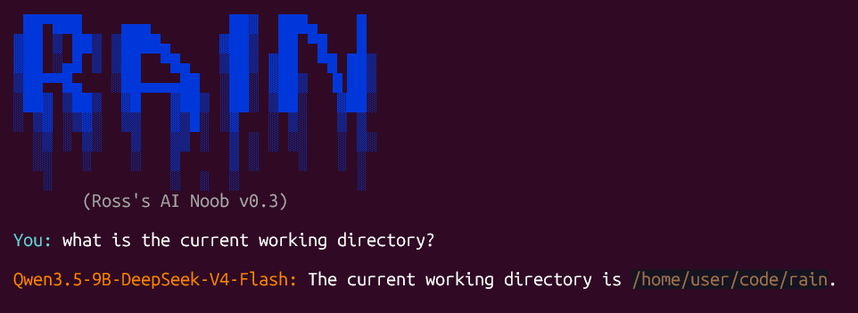

# R.A.I.N = Ross's AI Noob

**DO NOT RUN THIS :P** 

And if you do, make sure it's inside a Docker container or VM - it (intentionally) gives LLMs the ability to run any commands, with no guard rails.

This code base is a proof of concept custom AI Agent for learning+testing. It is not intended to be secure, useful, or compete with other more popular AI Agents.

It supports [Llama.cpp](https://llama-cpp.com/) (offline) or [Anthropic's Claude APIs](https://platform.claude.com), and tool usage.
